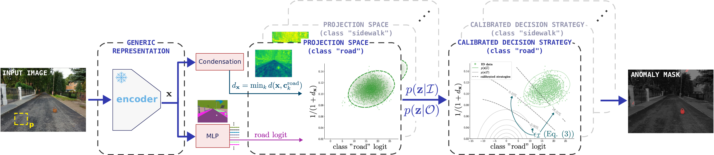

# PixOOD
Official implementation of the "PixOOD: Pixel-Level Out-of-Distribution Detection" ECCV 2024 paper

**[[Paper](http://arxiv.org/abs/2405.19882)]**



If you use this work please cite:
```latex
@InProceedings{Vojir_2024_ECCV,
    author    = {Vojíř, Tomáš and Šochman, Jan and Matas, Jiří},
    title     = {{PixOOD: Pixel-Level Out-of-Distribution Detection}},
    booktitle = {ECCV},
    year      = {2024},
}
```

## Update
- **2024.10.24 - Fixed bug in input image scaling if passed to pixood.py evaluation function as normalized tensor => improved results in table 1,2 (see newest version of the arXiv paper, and the commit fa5b13092a2d370a14bdc80e454311df5d01d690)**
- **2024.07.31 - 💥 Code published, inference tested "on my PC and it works" :)** 
- **2024.07.03 - Accepted to ECCV 2024**

## TODO
- [ ] Add documentation and comments
- [ ] Clean up and test the training code
- [ ] Streamline the training procedure

## Inference 
Download the pre-trained checkpoints (it uses [gdown](https://github.com/wkentaro/gdown) python app)
```
./checkpoints/download.sh
```

For example of single frame inference see the `example.ipynb`

For evaluation of whole sequence see example below:

https://github.com/user-attachments/assets/1993b638-794a-4338-8de5-071aa88c88bd

This command generated the video above (Note that it requires `ffmpeg` for video generation, otherwise the individual images are stored)  
```python
python plot.py --img_dir ./assets/test_seq --out_dir ./_out/vis --dname wos_seq1 --fps 10 --thr 0.995
```

## Training
The training code should work, but I did not test it after refactoring.

The PixOOD first train backbone with MLP classifier for in-distribution classes using configuration stored in `./code/config/dinov2_vit_l.yaml`:

```
cd code
CUDA_VISIBLE_DEVICES=0 python3 train.py --config ./config/dinov2_vit_l.yaml EXPERIMENT.NAME backbone_lp
```

Then run the Condensation alg. and estimate the decision strategy:

```
cd code
CUDA_VISIBLE_DEVICES=0 python3 train.py --config ./config/pixood.yaml EXPERIMENT.NAME pixood
```

Copy the new checkpoints:
```
cp ./_out/experiments/backbone_lp/checkpoints/checkpoint-best.pth ./checkpoints/checkpoint-backbone.pth
cp ./_out/experiments/pixood/checkpoints/checkpoint-latest.pth ./checkpoints/checkpoint-latest.pth
```
and the inference code should work. Note that if you change some configuration
you will probably need to copy the `parameters.yaml` from
`./_out/experiments/pixood/` to the git repo root directory and change the
`OUT_DIR` to `./`.

## Licence
Copyright (c) 2024 Toyota Motor Europe<br>
Patent Pending. All rights reserved.

This work is licensed under a [Creative Commons
Attribution-NonCommercial-ShareAlike 4.0 International
License](https://creativecommons.org/licenses/by-nc/4.0/)
